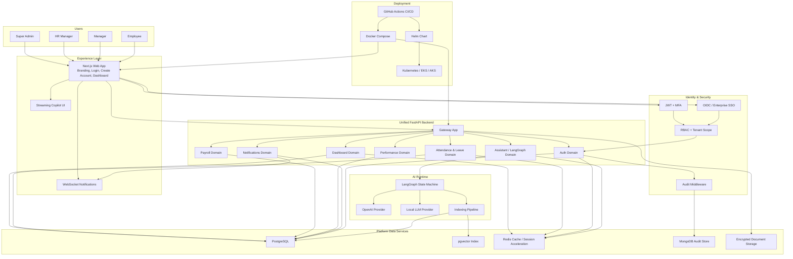

# NexusHR Architecture

## Architectural principles

- Domain-driven design with clean boundaries even inside the unified local backend
- Security-first identity model with JWT, OIDC/SSO hooks, MFA, and RBAC
- Multi-tenant isolation through org-scoped claims, tenant domains, and org-aware queries
- Production-ready persistence with PostgreSQL, Redis, MongoDB, and pgvector
- AI orchestration through LangGraph with OpenAI to local-LLM fallback

## High-level system architecture

## Runtime domains

### Auth

- Local JWT mode for direct development and seeded demo users
- OIDC/SSO launch hooks for enterprise federation
- MFA validation and role claim issuance

### Dashboard

- Consolidated monthly employee view
- Attendance, leave, holiday, and anomaly markers
- Cached employee month responses in Redis

### Attendance and leave

- Geofence-aware check-in
- Leave requests and approval paths
- Cache invalidation on write operations

### Notifications

- Tagged employee alerts for quick response
- Read acknowledgment APIs
- WebSocket push channel for live updates

### Assistant and RAG

- LangGraph state machine for classify → retrieve → answer → action
- pgvector-ready chunk storage
- OpenAI primary model with local-LLM fallback
- SSE streaming for frontend responses

## Deployment model

- Local: one FastAPI backend plus web app via Docker Compose
- Cloud: split web/backend deployments behind ingress with Redis/PostgreSQL/Mongo managed services
- Kubernetes packaging: Helm chart under [infra/helm/nexushr](D:\coledra-code\nexus-hr\infra\helm\nexushr)
