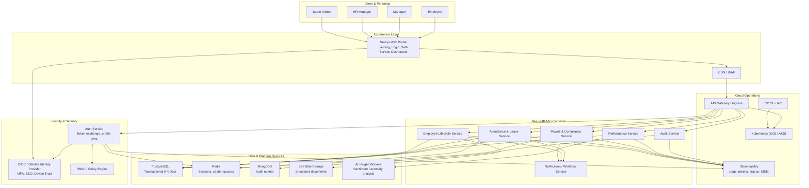

# NexusHR Architecture

## Architectural principles

- Microservice ownership by bounded context to keep HR workflows modular and independently deployable.
- Domain-driven design so employee lifecycle, attendance, payroll, performance, and audit streams stay cohesive.
- API-first delivery with FastAPI and OpenAPI for internal and external integrations.
- Zero-trust security posture with OIDC, MFA, RBAC, and immutable audit capture.
- Cloud-ready deployment model for AWS EKS or Azure Kubernetes Service with managed data services.

## High-level system architecture

## Service boundaries

### Employee lifecycle service

- Owns employee profiles, contracts, onboarding checklists, digital document pointers, assets, and offboarding events.
- Publishes lifecycle events that downstream services consume for payroll setup, access provisioning, and asset recovery.

### Attendance and leave service

- Owns shifts, geofence rules, check-in records, leave policies, leave balances, accrual jobs, and approval workflows.
- Uses Redis for short-lived geolocation/session caching and approval workflow acceleration.

### Payroll and compliance service

- Owns salary structures, pay runs, deduction rules, tax adapters, payslips, and statutory extracts for EPF, ESI, and TDS.
- Integrates with notification services for payroll closure and payslip delivery.

### Performance service

- Owns OKRs, performance cycles, calibration data, 360-degree feedback, and sentiment-analysis orchestration.
- Sends review text to AI workers through an asynchronous queue for sentiment scoring and anomaly flags.

### Audit service

- Centralizes write-operation audit events across all services.
- Stores immutable compliance records in MongoDB with search indexes for regulators and internal audit teams.

## Security model

- Authentication: OIDC/OAuth2 with MFA, device trust, and external IdP federation support.
- Authorization: RBAC permissions mapped to Super Admin, HR Manager, Manager, and Employee personas.
- Audit: every POST, PUT, PATCH, and DELETE operation is logged with timestamp, IP, service, user ID, and result.
- Data protection: TLS in transit, S3 encryption at rest, database-level encryption options, and secrets externalized to the runtime.
- Privacy: consent-aware document handling, retention workflows, and deletion/anonymization hooks for GDPR requests.

## Recommended deployment topology

- Frontend deployed as a containerized Next.js application behind CDN and WAF.
- FastAPI services deployed as independent Kubernetes workloads with horizontal pod autoscaling.
- PostgreSQL, Redis, MongoDB, and S3 hosted as managed cloud services when running in production.
- Observability routed to a SIEM stack to meet ISO 27001 monitoring and incident-response controls.

## Development deployment profile

- For local development, NexusHR can run as a single FastAPI backend that includes all HR domains as modular routers.
- This keeps onboarding and debugging simple while preserving the same route contracts and shared security middleware.
- The unified backend lives in [backend/app/main.py](D:\coledra-code\nexus-hr\backend\app\main.py) and the domain routers live in [backend/app/routers](D:\coledra-code\nexus-hr\backend\app\routers).
