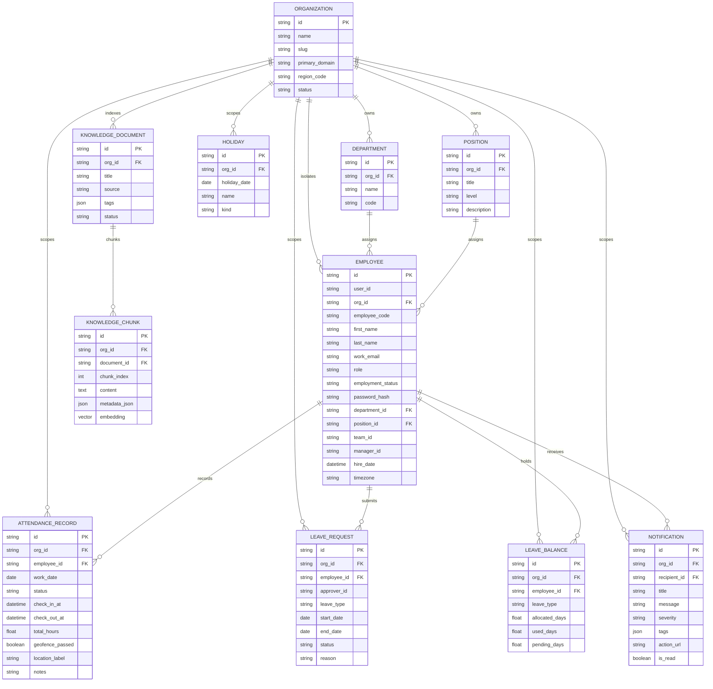

# NexusHR Core ERD

This ERD reflects the runnable backend schema used for the current dashboard, attendance, leave, notifications, and RAG features.

```mermaid
erDiagram
    ORGANIZATION ||--o{ DEPARTMENT : owns
    ORGANIZATION ||--o{ POSITION : owns
    ORGANIZATION ||--o{ EMPLOYEE : isolates
    ORGANIZATION ||--o{ ATTENDANCE_RECORD : scopes
    ORGANIZATION ||--o{ LEAVE_REQUEST : scopes
    ORGANIZATION ||--o{ LEAVE_BALANCE : scopes
    ORGANIZATION ||--o{ HOLIDAY : scopes
    ORGANIZATION ||--o{ NOTIFICATION : scopes
    ORGANIZATION ||--o{ KNOWLEDGE_DOCUMENT : indexes
    KNOWLEDGE_DOCUMENT ||--o{ KNOWLEDGE_CHUNK : chunks
    DEPARTMENT ||--o{ EMPLOYEE : assigns
    POSITION ||--o{ EMPLOYEE : assigns
    EMPLOYEE ||--o{ ATTENDANCE_RECORD : records
    EMPLOYEE ||--o{ LEAVE_REQUEST : submits
    EMPLOYEE ||--o{ LEAVE_BALANCE : holds
    EMPLOYEE ||--o{ NOTIFICATION : receives

    ORGANIZATION {
        string id PK
        string name
        string slug
        string primary_domain
        string region_code
        string status
    }

    DEPARTMENT {
        string id PK
        string org_id FK
        string name
        string code
    }

    POSITION {
        string id PK
        string org_id FK
        string title
        string level
        string description
    }

    EMPLOYEE {
        string id PK
        string user_id
        string org_id FK
        string employee_code
        string first_name
        string last_name
        string work_email
        string role
        string employment_status
        string password_hash
        string department_id FK
        string position_id FK
        string team_id
        string manager_id
        datetime hire_date
        string timezone
    }

    ATTENDANCE_RECORD {
        string id PK
        string org_id FK
        string employee_id FK
        date work_date
        string status
        datetime check_in_at
        datetime check_out_at
        float total_hours
        boolean geofence_passed
        string location_label
        string notes
    }

    LEAVE_REQUEST {
        string id PK
        string org_id FK
        string employee_id FK
        string approver_id
        string leave_type
        date start_date
        date end_date
        string status
        string reason
    }

    LEAVE_BALANCE {
        string id PK
        string org_id FK
        string employee_id FK
        string leave_type
        float allocated_days
        float used_days
        float pending_days
    }

    HOLIDAY {
        string id PK
        string org_id FK
        date holiday_date
        string name
        string kind
    }

    NOTIFICATION {
        string id PK
        string org_id FK
        string recipient_id FK
        string title
        string message
        string severity
        json tags
        string action_url
        boolean is_read
    }

    KNOWLEDGE_DOCUMENT {
        string id PK
        string org_id FK
        string title
        string source
        json tags
        string status
    }

    KNOWLEDGE_CHUNK {
        string id PK
        string org_id FK
        string document_id FK
        int chunk_index
        text content
        json metadata_json
        vector embedding
    }
```
