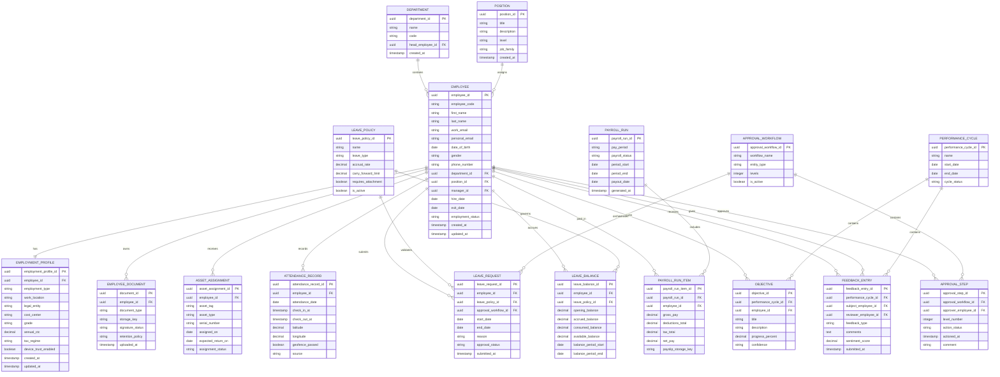

# NexusHR Core ERD

The ERD below models the HR core with coverage for employee lifecycle, attendance, leave, payroll, performance, documents, assets, and approval workflows.

```mermaid
erDiagram
    DEPARTMENT ||--o{ EMPLOYEE : contains
    POSITION ||--o{ EMPLOYEE : assigns
    EMPLOYEE ||--|| EMPLOYMENT_PROFILE : has
    EMPLOYEE ||--o{ EMPLOYEE_DOCUMENT : owns
    EMPLOYEE ||--o{ ASSET_ASSIGNMENT : receives
    EMPLOYEE ||--o{ ATTENDANCE_RECORD : records
    EMPLOYEE ||--o{ LEAVE_REQUEST : submits
    EMPLOYEE ||--o{ LEAVE_BALANCE : accrues
    EMPLOYEE ||--o{ PAYROLL_RUN_ITEM : paid_in
    EMPLOYEE ||--o{ OBJECTIVE : owns
    EMPLOYEE ||--o{ FEEDBACK_ENTRY : receives
    EMPLOYEE ||--o{ FEEDBACK_ENTRY : gives
    EMPLOYEE ||--o{ APPROVAL_STEP : approves
    LEAVE_POLICY ||--o{ LEAVE_BALANCE : governs
    LEAVE_POLICY ||--o{ LEAVE_REQUEST : validates
    APPROVAL_WORKFLOW ||--o{ APPROVAL_STEP : contains
    APPROVAL_WORKFLOW ||--o{ LEAVE_REQUEST : orchestrates
    PAYROLL_RUN ||--o{ PAYROLL_RUN_ITEM : includes
    PERFORMANCE_CYCLE ||--o{ OBJECTIVE : contains
    PERFORMANCE_CYCLE ||--o{ FEEDBACK_ENTRY : contains

    EMPLOYEE {
        uuid employee_id PK
        string employee_code
        string first_name
        string last_name
        string work_email
        string personal_email
        date date_of_birth
        string gender
        string phone_number
        uuid department_id FK
        uuid position_id FK
        uuid manager_id FK
        date hire_date
        date exit_date
        string employment_status
        timestamp created_at
        timestamp updated_at
    }

    EMPLOYMENT_PROFILE {
        uuid employment_profile_id PK
        uuid employee_id FK
        string employment_type
        string work_location
        string legal_entity
        string cost_center
        string grade
        decimal annual_ctc
        string tax_regime
        boolean device_trust_enabled
        timestamp created_at
        timestamp updated_at
    }

    DEPARTMENT {
        uuid department_id PK
        string name
        string code
        uuid head_employee_id FK
        timestamp created_at
    }

    POSITION {
        uuid position_id PK
        string title
        string description
        string level
        string job_family
        timestamp created_at
    }

    EMPLOYEE_DOCUMENT {
        uuid document_id PK
        uuid employee_id FK
        string document_type
        string storage_key
        string signature_status
        string retention_policy
        timestamp uploaded_at
    }

    ASSET_ASSIGNMENT {
        uuid asset_assignment_id PK
        uuid employee_id FK
        string asset_tag
        string asset_type
        string serial_number
        date assigned_on
        date expected_return_on
        string assignment_status
    }

    ATTENDANCE_RECORD {
        uuid attendance_record_id PK
        uuid employee_id FK
        date attendance_date
        timestamp check_in_at
        timestamp check_out_at
        decimal latitude
        decimal longitude
        boolean geofence_passed
        string source
    }

    LEAVE_POLICY {
        uuid leave_policy_id PK
        string name
        string leave_type
        decimal accrual_rate
        decimal carry_forward_limit
        boolean requires_attachment
        boolean is_active
    }

    LEAVE_BALANCE {
        uuid leave_balance_id PK
        uuid employee_id FK
        uuid leave_policy_id FK
        decimal opening_balance
        decimal accrued_balance
        decimal consumed_balance
        decimal available_balance
        date balance_period_start
        date balance_period_end
    }

    LEAVE_REQUEST {
        uuid leave_request_id PK
        uuid employee_id FK
        uuid leave_policy_id FK
        uuid approval_workflow_id FK
        date start_date
        date end_date
        string reason
        string approval_status
        timestamp submitted_at
    }

    APPROVAL_WORKFLOW {
        uuid approval_workflow_id PK
        string workflow_name
        string entity_type
        integer levels
        boolean is_active
    }

    APPROVAL_STEP {
        uuid approval_step_id PK
        uuid approval_workflow_id FK
        uuid approver_employee_id FK
        integer level_number
        string action_status
        timestamp actioned_at
        string comment
    }

    PAYROLL_RUN {
        uuid payroll_run_id PK
        string pay_period
        string payroll_status
        date period_start
        date period_end
        date payout_date
        timestamp generated_at
    }

    PAYROLL_RUN_ITEM {
        uuid payroll_run_item_id PK
        uuid payroll_run_id FK
        uuid employee_id FK
        decimal gross_pay
        decimal deductions_total
        decimal tax_total
        decimal net_pay
        string payslip_storage_key
    }

    PERFORMANCE_CYCLE {
        uuid performance_cycle_id PK
        string name
        date start_date
        date end_date
        string cycle_status
    }

    OBJECTIVE {
        uuid objective_id PK
        uuid performance_cycle_id FK
        uuid employee_id FK
        string title
        string description
        decimal progress_percent
        string confidence
    }

    FEEDBACK_ENTRY {
        uuid feedback_entry_id PK
        uuid performance_cycle_id FK
        uuid subject_employee_id FK
        uuid reviewer_employee_id FK
        string feedback_type
        text comments
        decimal sentiment_score
        timestamp submitted_at
    }
```
