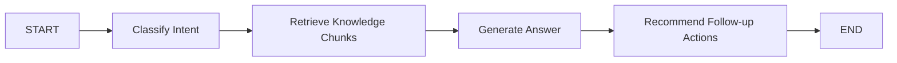

# RAG, Redis, and Indexing Strategy

## Redis caching strategy

NexusHR uses Redis for low-latency reads and write-triggered invalidation.

Primary cache keys:

- `dashboard:{org_id}:{employee_id}:{month}`: monthly employee dashboard payload
- `notifications:{org_id}:{employee_id}`: employee notification feed

Invalidation rules:

- Attendance check-in invalidates the employee dashboard cache
- Leave approval invalidates the employee dashboard cache and notification feed
- Notification creation invalidates only the target employee notification feed

Fallback behavior:

- If Redis is unavailable, the backend uses an in-memory cache layer so local execution still works

Implementation:

- Cache service: [backend/app/services/cache.py](D:\coledra-code\nexus-hr\backend\app\services\cache.py)

## RAG indexing pipeline

The assistant supports an actual indexing pipeline:

1. Documents arrive through `POST /v1/assistant/index`
2. Content is chunked into overlapping text windows
3. Embeddings are generated
   - Primary: OpenAI embeddings when `NEXUSHR_OPENAI_API_KEY` is configured
   - Fallback: deterministic local embeddings for offline/dev usage
4. Documents and chunks are stored in PostgreSQL
5. Embeddings are stored in a pgvector column for nearest-neighbor retrieval
6. A memory vector store is also maintained so the assistant remains usable without Postgres

Implementation:

- Embeddings: [backend/app/services/embeddings.py](D:\coledra-code\nexus-hr\backend\app\services\embeddings.py)
- Vector store: [backend/app/services/vector_store.py](D:\coledra-code\nexus-hr\backend\app\services\vector_store.py)

## LangGraph orchestration

The assistant flow is implemented as a state machine:

Nodes:

- Intent classification maps user questions to attendance, leave, payroll, performance, or general HR
- Retrieval queries the pgvector-ready knowledge store
- Response generation uses OpenAI first, then a local LLM endpoint, then a rule-based fallback
- Follow-up actions provide the next task to complete in the dashboard

Implementation:

- LangGraph service: [backend/app/services/assistant.py](D:\coledra-code\nexus-hr\backend\app\services\assistant.py)

## Multi-tenant isolation

The assistant and dashboard both read and write only within the org scope carried in the JWT claims.

Isolation controls:

- `org_id` and `tenant_slug` are embedded in local tokens
- Every protected route uses the authenticated principal
- Data queries filter by `org_id`
- Notification streams are user-scoped and token-protected

## Streaming and delivery

- `POST /v1/assistant/stream` returns SSE output for progressive answer rendering
- `GET /v1/notifications/ws/notifications` provides WebSocket delivery for alert updates
